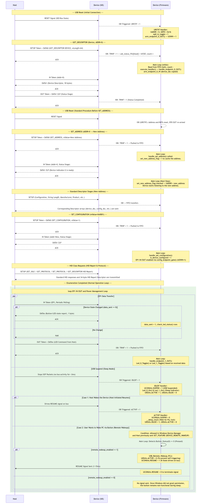

# PIC18F47J53 Custom USB HID Stack

This repository contains a bare-metal, lightweight, and custom USB 1.1/2.0 compliant HID communication stack designed for the **PIC18F47J53** microcontroller. Unlike standard microchip libraries (MLA/MCC), this implementation uses a custom-tailored transaction FIFO architecture to decouple the Interrupt Service Routine (ISR) from the main application loop, maximizing timing efficiency and robustness.

## 📊 USB Enumeration & Power Management Sequence

Below is the complete sequence of how the hardware (SIE), custom firmware, and host operating system interact during initial connection, enumeration, and low-power states.



---

## 📱 Host Application Interface

To test the bi-directional communication, a Python-based GUI application is included. It monitors real-time physical button states transmitted by the PIC18F47J53 and allows independent control over the onboard LEDs.


---

## 🚀 Key Features

* **Zero Framework Dependency:** Fully written from scratch in C without using Microchip MLA or MCC USB libraries.
* **Decoupled Architecture:** A 4-byte circular status FIFO (`usb_status_fifo`) registers hardware tokens inside the high-priority ISR (`TRNIF`), which are later processed asynchronously in the main loop execution handler.
* **Full HID Class Support:** Includes custom Endpoint 0 control transfer routing for standard and HID-specific descriptors (Report Descriptor, SET_IDLE, SET_PROTOCOL).
* **Dual Endpoint Operations:** Control Endpoint 0 (64-byte chunks) handles enumeration, while Endpoint 1 handles bi-directional, periodic HID report streaming (LED and Button states).
* **Advanced Power Management:** Full hardware `SUSPND` (Suspend), `ACTVIF` (Activity-based Host Resume), and custom `RESUME` (Remote Wakeup) signal generation support.

---

## ⚡ Technical Requirements & Environment

* **IDE:** MPLAB X IDE v6.20
* **Compiler:** MPLAB XC8 Compiler
* **Microcontroller:** Microchip PIC18F47J53
* **Clock Configuration:** 16 MHz external oscillator input scaled to 4 MHz via PLL divider, driving the 96 MHz PLL internally to provide the accurate 48 MHz USB clock and CPU system clock.

---

## ⚠️ Crucial Note on Power Management & Windows OS Restrictions

The firmware implements standard **USB Remote Wakeup** capability via a physical hardware button. However, according to the official USB specification, **the device cannot unilaterally wake up the host computer.**

> ### 🛑 **Windows Device Manager Permission Requirement**
> Even if the device architecture is fully ready to assert a `K-State` resume signal onto the USB bus (`UCONbits.RESUME = 1`), **the button will remain completely non-functional during sleep mode unless Windows explicitly grants permission.**
>
> To enable this functionality:
> 1. Open **Device Manager** on your Windows host.
> 2. Locate this HID Device, right-click, and select **Properties**.
> 3. Navigate to the **Power Management** tab.
> 4. You **MUST** check the box that says: **"Allow this device to wake the computer"**.
>
> **How it works underneath:** When this checkbox is marked, Windows sends a standard `SET_FEATURE (DEVICE_REMOTE_WAKEUP)` token to the device right before entering sleep. The firmware catches this packet and flags `remote_wakeup_enabled = 1`. If this token is not sent by Windows, the firmware safely ignores button presses during suspend to prevent bus protocol violations.

---

## 📁 Project Structure

```text
PIC18F47J53-Bare-Metal-USB/
├── docs/
│   ├── gui_preview.png                 # GUI application preview screenshot
│   └── usb_sequence.png                # USB sequence diagram (generated via Mermaid)
├── firmware/
│   ├── inc/                            # C Header Files (.h)
│   │   ├── Button.h                    # Button abstraction definitions
│   │   ├── config.h                    # Configuration bits for PIC18F47J53
│   │   ├── ISR.h                       # Interrupt service manager prototypes
│   │   ├── Led.h                       # LED control definitions
│   │   ├── Pin_config.h                # Hardware pin & system clock maps
│   │   ├── usb_ds.h                    # USB setup tokens & buffer structures
│   │   └── Variables.h                 # Volatile global status flags
│   ├── src/                            # C Source Files (.c)
│   │   ├── Button.c                    # Physical button IO reading routines
│   │   ├── ISR.c                       # Fast-paced USB interrupt handler
│   │   ├── Led.c                       # LED state control implementations
│   │   ├── main_ds.c                   # Main token-consumer loop execution
│   │   ├── Pin_config.c                # Clock multipliers and PLL setups
│   │   └── usb_ds.c                    # Descriptor tables and endpoint routing
│   └── USB_project_1.X/                # MPLAB X Project Configuration Directory
│       ├── nbproject/                  # IDE Project Metadata & Build Settings
│       │   ├── configurations.xml
│       │   ├── Makefile-default.mk
│       │   ├── Makefile-genesis.properties
│       │   ├── Makefile-impl.mk
│       │   ├── Makefile-local-default.mk
│       │   ├── Makefile-variables.mk
│       │   └── project.xml
│       └── Makefile                    # Main project Makefile for compilation
├── host/
│   └── usb_communication.py            # Host-side Python GUI application (Tkinter & hidapi)
└── README.md                           # Project documentation
```

---

## 🔧 Building & Running the Project

### Firmware (Microcontroller)
1. Clone this repository into your local directory.
2. Open **MPLAB X IDE v6.20**.
3. Select **File > Open Project** and navigate to `firmware/USB_project_1.X`.
4. Ensure the **XC8 Compiler** is selected in your project properties.
5. Click **Clean and Build Main Project**.
6. Flash the compiled `.hex` file onto your PIC18F47J53 board using PICkit or ICD programmers.

### Host Application (Python)
1. Navigate to the `host/` folder.
2. Install the required `hidapi` wrapper library for Python:
   ```bash
   pip install hidapi
   ```
3. Run the application:
   ```bash
   python usb_communication.py
   ```